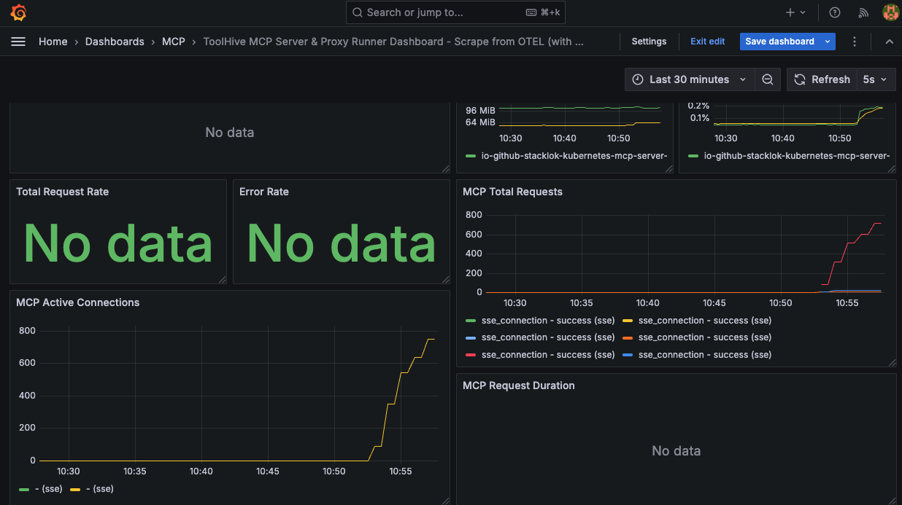

# MCP Registry Demo on Openshift

## Setup Toolhive
Note: in case, build operator image for `amd64` platform:
```
PLATFORM=linux/amd64 task build-operator-image-ubi
```

**Note**: I had to build a custom image because of some last-minutes issues I had to fix, otherwise the CR does not properly deploy the server:
https://github.com/stacklok/toolhive/pull/2914 (still open, I think the team expects me to fix all the feature, but I won't do that, not my daily goal)

Install CRDs (assuming repos are installed from the same parent folder):
```
helm upgrade --install toolhive-operator-crds ../../toolhive/deploy/charts/operator-crds --namespace toolhive-system \
--create-namespace
oc get crd | grep mcp
```

Uninstall the operator (if needed):
```
helm uninstall toolhive-operator
```

Install the operator from values in current folder:
```
helm upgrade --install toolhive-operator ../../toolhive/deploy/charts/operator --namespace toolhive-system \
--create-namespace \
--values ./values-openshift.yaml
oc get pods -w
```
(these values mainly override the runtime images)


List installed charts:
```
helm list
```

## Setup and deploy Postgres
Prerequisites:
- Install `CloudNativePG` operator (namespace only)

Verify CRDs:
```
oc get crd | grep postgres
```

Delete demo DB:
```
oc delete clusters.postgresql.cnpg.io demo-db
```

Install demo DB:
```
oc apply -f psql.yaml
oc get pods -w
```

## Deploy MCP registry

Create additiona ConfigMaps
```
oc create cm rh-catalog-mcp --from-file registry.json=rh-catalog-mcp.json
oc create cm rh-partners-mcp --from-file registry.json=rh-partners-mcp.json
oc create cm rh-one-mcp --from-file registry.json=rh-one-mcp.json
```

Catalog source is the ToolHive registry data from the git repo:
```
oc delete -f mcpregistry-git-toolhive.yaml
```

```
oc apply -f mcpregistry-git-toolhive.yaml
oc get mcpregistry
oc get pods -w
```
The manifest is a bit different from the original in the `toolhive` repo because of necessary fixes:
* Can't use `default` name in the registry (it's aready auto-assigned to a kubernetes registry created to watch `MCPServer` instances and discover servers)
* Added DB configuration
  * This includes adding `dbAppUserPasswordSecretRef` and `dbMigrationUserPasswordSecretRef`
  to initialize a `Secret` storing the `pgpass` file from the `demo-registry-db-password` (also part of the manifest)


Verify service:
```
oc get svc
```

Test query
```
oc exec $(oc get pods -l app.kubernetes.io/component=registry-api -oname) -- curl http://localhost:8080/registry/v0.1/servers
```

### Connecting MCPServers
Use the folowing annotations to connect an `MCPServer` instance to the existing registry:
```yaml
toolhive.stacklok.dev/registry-description: yet another MCP server
toolhive.stacklok.dev/registry-export: "true"
toolhive.stacklok.dev/registry-url: http://demo-registry-api.toolhive-system.svc.cluster.local:8080
```
(replace the registry URL with the local registry)

Sample query to check the deployment is registered:
```
curl localhost:8888/registry/default/v0.1/servers | jq
  % Total    % Received % Xferd  Average Speed   Time    Time     Time  Current
                                 Dload  Upload   Total   Spent    Left  Speed
100  1209  100  1209    0     0   3203      0 --:--:-- --:--:-- --:--:--  3206
{
  "servers": [
    {
      "server": {
        "$schema": "https://static.modelcontextprotocol.io/schemas/2025-12-11/server.schema.json",
        "name": "com.toolhive.k8s.toolhive-system/io-github-stacklok-kubernetes-mcp-server",
        "description": "yet another MCP server",
        "version": "1.0.0",
        "packages": [
          {
            "registryType": "oci",
            "identifier": "quay.io/containers/kubernetes_mcp_server:latest-linux-amd64",
            "version": "latest-linux-amd64",
            "transport": {
              "type": "sse"
            }
          }
        ],
        "remotes": [
          {
            "type": "streamable-http",
            "url": "http://demo-registry-api.toolhive-system.svc.cluster.local:8080"
          }
        ],
        "_meta": {
          "io.modelcontextprotocol.registry/publisher-provided": {
            "server_meta": "eyJpby5naXRodWIuc3RhY2tsb2siOiB7Imh0dHA6Ly9kZW1vLXJlZ2lzdHJ5LWFwaS50b29saGl2ZS1zeXN0ZW0uc3ZjLmNsdXN0ZXIubG9jYWw6ODA4MCI6IHsibWV0YWRhdGEiOiB7Imt1YmVybmV0ZXNfdWlkIjogIjMzYTQ3YWM4LThkODItNDk1OS1hM2QyLWI1YWI3NGI0MzZhZSIsICJrdWJlcm5ldGVzX2tpbmQiOiAiTUNQU2VydmVyIiwgImt1YmVybmV0ZXNfbmFtZSI6ICJpby1naXRodWItc3RhY2tsb2sta3ViZXJuZXRlcy1tY3Atc2VydmVyIiwgImt1YmVybmV0ZXNfaW1hZ2UiOiAicXVheS5pby9jb250YWluZXJzL2t1YmVybmV0ZXNfbWNwX3NlcnZlcjpsYXRlc3QtbGludXgtYW1kNjQiLCAia3ViZXJuZXRlc19uYW1lc3BhY2UiOiAidG9vbGhpdmUtc3lzdGVtIiwgImt1YmVybmV0ZXNfdHJhbnNwb3J0IjogInNzZSJ9fX19"
          }
        }
      },
      "_meta": {}
    }
  ],
  "metadata": {
    "count": 1
  }
}
```

## Monitoring

The sample server manifests includes the required settings to enable pushing metrics to OpenTelemetry and scrape system metrics from Prometheus:
```yaml
  telemetry:
    openTelemetry:
      enabled: true
      # Your OTEL collector service, e.g. otel-collector.openshift-opentelemetry-operator.svc.cluster.local:4318
      endpoint: _OTEL_COLLECTOR_SERVICE_
      # Change this to match your filter criteria in the dashboard 
      serviceName: kubernetes-mcp-server
      insecure: true # Using HTTP collector endpoint
      metrics:
        enabled: true
      tracing:
        enabled: true
        samplingRate: '1.0'
    prometheus:
      # Enable scraping system metrics from Prometheus
      enabled: true
```

In order to properly forward and collect the metrics, the `OpenTelemetryCOllector` must include the=se sections:
```yaml
...
    exporters:
      debug: {}
      prometheus:
        endpoint: '0.0.0.0:8889'
        resource_to_telemetry_conversion:
          enabled: true
...
    service:
      pipelines:
        metrics:
          exporters:
            - debug
            - prometheus
...
```

The [sample Grafana dashboard](./mcp_dashboard.json) sets a reference for metrics that 
could be collected from the collector.

The following application metrics are computed and exported to the collector:
- toolhive_mcp_active_connections: Number of active MCP connections
- toolhive_mcp_requests: Total number of MCP requests
- toolhive_mcp_request_duration: Duration of MCP requests in seconds
- toolhive_mcp_tool_calls: Total number of MCP tool calls
**Note**: for servers using the SSE transport protocol, only the first 2 metrics are available




